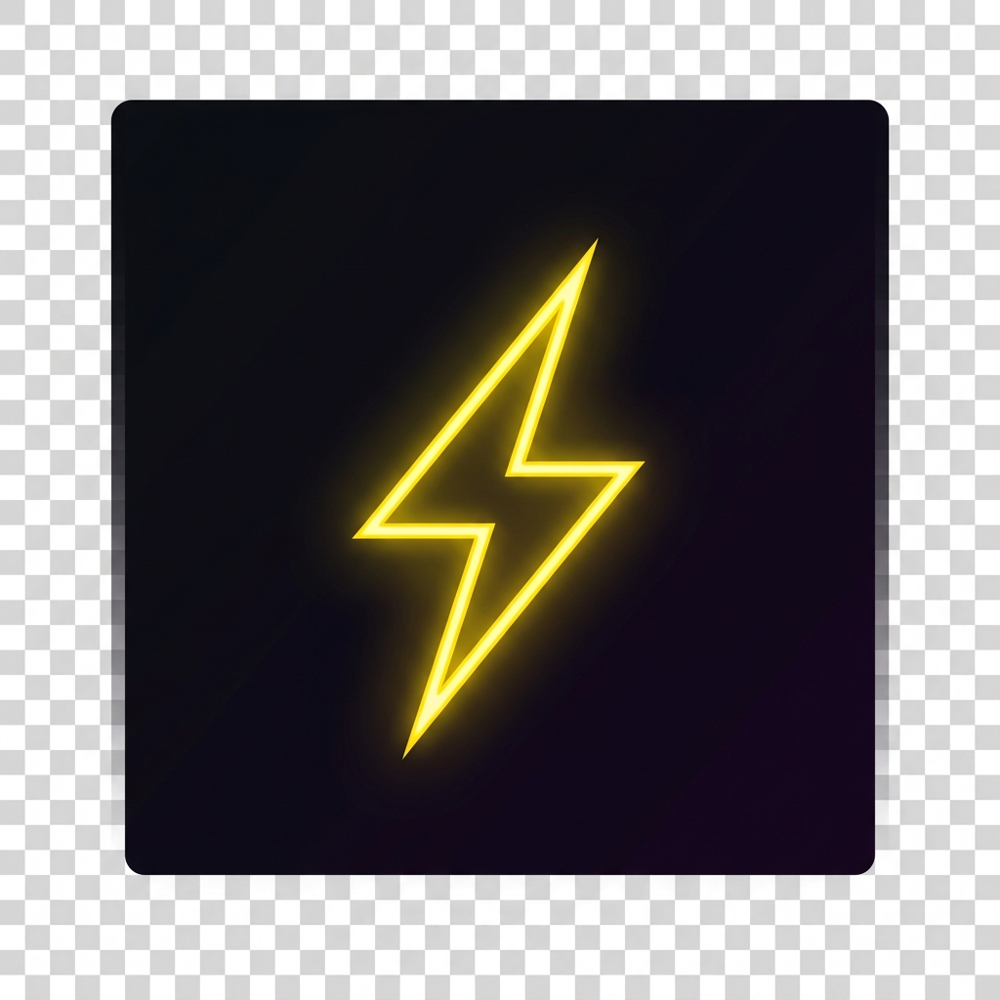

<div align="center">



# ⚡ QuickZack

### Lightning-fast project launcher for developers

**Hit `Alt+Space` anywhere → type a few letters → open your project instantly.**  
No more hunting through File Explorer. No more slow IDE startup dialogs.  
Now available on **Windows** and **macOS**.

<br/>

[](https://github.com)
[](https://github.com)
[](https://electronjs.org)
[](LICENSE)
[](https://github.com)
[](https://github.com)

<br/>

[**🪟 Download for Windows**](#-download) &nbsp;·&nbsp; [**🍎 Download for macOS**](#-download) &nbsp;·&nbsp; [**📖 Docs**](#-configuration)

</div>

---

## 🎯 What is QuickZack?

QuickZack is a **keyboard-driven project launcher** that lives in your system tray. It scans your projects folder and lets you open any project in your favorite editor — in under a second.

Think of it like **Spotlight / Raycast for your dev projects**, but on Windows.

```
Press Alt+Space  →  Type "my-re"  →  Highlights "my-react-app"  →  Press Enter  →  Done ✅
```

---

## ✨ Features

| Feature                | Description                                                |
| ---------------------- | ---------------------------------------------------------- |
| ⚡ **Global Shortcut** | `Alt+Space` from anywhere — browser, terminal, wherever    |
| 🔍 **Fuzzy Search**    | Powered by Fuse.js — typos are fine, it gets you           |
| 🎯 **Any Editor**      | VS Code, PHPStorm, Sublime, or any custom command          |
| 🔀 **Auto Detection**  | Identifies Node, PHP, Python, Rust, Go, Java, Git projects |
| 🗂️ **System Tray**     | Runs silently, zero taskbar clutter                        |
| ⌨️ **Keyboard First**  | `↑↓` navigate, `Enter` open, `Esc` close — no mouse needed |
| ⚙️ **Simple Config**   | One JSON file to configure everything                      |
| 🚫 **No Account**      | No login, no cloud, no telemetry. 100% local.              |
| 🍎 **macOS Support**   | Native Apple Silicon & Intel Mac builds                    |

---

## 🚀 Quick Start

### 1. Download & Install

**Windows:** Download the installer or portable `.exe` from the [**Releases**](#-download) section.

**macOS:** Download the `.dmg` for your Mac (Apple Silicon or Intel). Open the `.dmg` and drag QuickZack to Applications.

> **macOS users:** On first launch, right-click the app → **Open** to bypass Gatekeeper.

### 2. Configure your projects folder

After install, **right-click the tray/menu bar icon** → **Edit config.json**:

```json
{
  "projects_path": "~/Projects",
  "editor_command": "code",
  "shortcut": "Alt+Space",
  "max_depth": 1,
  "exclude_folders": [".git", "node_modules", "vendor", ".vs", "__pycache__"]
}
```

> **Tip:** Use `~/Projects` on macOS, `C:/xampp/htdocs` or `C:/Users/you/Projects` on Windows.

### 3. Launch!

Press **`Alt+Space`** anywhere → start typing → press **`Enter`** to open in your editor.

---

## ⬇️ Download

### Windows

| Package                                                         | Description                                 | Size  |
| --------------------------------------------------------------- | ------------------------------------------- | ----- |
| [**QuickZack Setup 1.3.1.exe**](https://github.com/rahulsharma841990/quick-zack/releases/download/v1.3.1/QuickZack.Setup.1.3.1.exe)    | Full installer with Start Menu & auto-start | ~74MB |
| [**QuickZack-Portable-1.3.1.exe**](https://github.com/rahulsharma841990/quick-zack/releases/download/v1.3.1/QuickZack-Portable-1.3.1.exe) | No install needed, run anywhere             | ~73MB |

> **Requirements:** Windows 10 or 11 (64-bit)

### macOS

| Package                                                         | Description                                 | Size  |
| --------------------------------------------------------------- | ------------------------------------------- | ----- |
| [**QuickZack-1.3.1-arm64.dmg**](https://github.com/rahulsharma841990/quick-zack/releases/download/v1.3.1/QuickZack-1.3.1-arm64.dmg) | Apple Silicon (M1/M2/M3/M4)                 | ~93MB |
| [**QuickZack-1.3.1.dmg**](https://github.com/rahulsharma841990/quick-zack/releases/download/v1.3.1/QuickZack-1.3.1.dmg) | Intel Mac (x64)                             | ~100MB |

> **Requirements:** macOS 12+ (Monterey or later)

---

## ⚙️ Configuration

Edit `config.json` via the tray icon → **Edit config.json**

| Key               | Default                         | Description                                               |
| ----------------- | ------------------------------- | --------------------------------------------------------- |
| `projects_path`   | `C:/xampp/htdocs`               | Root folder that QuickZack scans for projects             |
| `editor_command`  | `code`                          | Command to open editor (`code`, `phpstorm`, `subl`, etc.) |
| `shortcut`        | `Alt+Space`                     | Global keyboard shortcut to toggle the launcher           |
| `max_depth`       | `1`                             | How deep to scan for projects (1 = direct children only)  |
| `exclude_folders` | `[".git", "node_modules", ...]` | Folders to skip during scan                               |

### Editor Command Examples

```json
"editor_command": "code"          // VS Code
"editor_command": "phpstorm"      // JetBrains PHPStorm
"editor_command": "subl"          // Sublime Text
"editor_command": "webstorm"      // JetBrains WebStorm
"editor_command": "notepad++ {path}"  // Custom with {path} placeholder
```

---

## 🔍 How It Works

```
┌─────────────────────────────────────────────────────┐
│  You press Alt+Space                                │
│           ↓                                         │
│  QuickZack pops up (glassmorphism UI)               │
│           ↓                                         │
│  You type "ract"                                    │
│           ↓                                         │
│  Fuse.js fuzzy-matches → shows "my-react-app" 🎯   │
│           ↓                                         │
│  You press Enter                                    │
│           ↓                                         │
│  editor_command opens the project folder            │
│           ↓                                         │
│  Window hides itself. Done. ⚡                      │
└─────────────────────────────────────────────────────┘
```

### Detected Project Types

| Icon | Type     | Detection                        |
| ---- | -------- | -------------------------------- |
| 📦   | Node.js  | `package.json` present           |
| 🐘   | PHP      | `composer.json` present          |
| 🐍   | Python   | `requirements.txt` or `setup.py` |
| 🦀   | Rust     | `Cargo.toml` present             |
| 🐹   | Go       | `go.mod` present                 |
| ☕   | Java     | `pom.xml` or `build.gradle`      |
| 🔀   | Git Repo | `.git` folder present            |
| 📁   | Folder   | Default                          |

---

## 🛠️ Build from Source

```bash
# Clone the repo
git clone https://github.com/yourusername/quick-zack.git
cd quick-zack

# Install dependencies
npm install

# Run in development mode
npm run dev

# Build installer for Windows
npm run build

# Build for macOS (DMG + ZIP, x64 + arm64)
npm run build:mac

# Build for both platforms
npm run build:all

# Build without installer (just the folder)
npm run build:dir
```

> **Requirements:** Node.js 18+, npm

Built with:

- [Electron](https://electronjs.org) v28
- [Fuse.js](https://fusejs.io) v7 — fuzzy search
- [electron-builder](https://www.electron.build) — packaging

---

## 📁 Project Structure

```
quick-zack/
├── main.js          # Main process — tray, shortcuts, IPC, window
├── preload.js       # Secure bridge between main & renderer
├── index.html       # The launcher UI (single file, all CSS + JS)
├── config.json      # Default config (copied to userData on first run)
├── tray-icon.png    # System tray icon
├── assets/
│   └── icon.ico     # App icon for installer
└── landing/
    └── index.html   # Project landing/download page
```

---

## 🤝 Contributing

Contributions are welcome! Feel free to:

- 🐛 **Report bugs** via [Issues](https://github.com)
- 💡 **Suggest features** via [Discussions](https://github.com)
- 🔧 **Submit Pull Requests** for fixes or enhancements

---

## 📝 License

MIT — free to use, modify, and distribute.

---

<div align="center">

Made with ❤️ for developers who hate slow workflows.

⭐ **Star this repo if QuickZack saved you time!** ⭐

</div>
